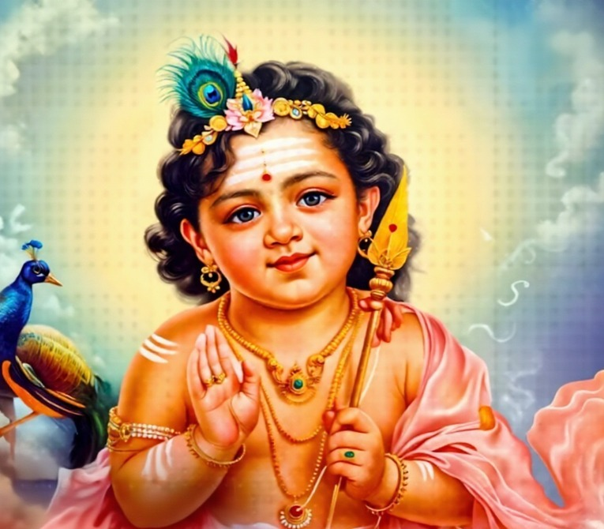

# 🦚 Lord Muruga Tribute Page

  

  <strong>ஓம் சரவண பவ — Om Saravana Bhava</strong> 
  A heartfelt tribute to Lord Muruga, the God of Wisdom, Youth, and Grace.

---

## 🙏 About This Project

This is a simple **HTML & CSS tribute webpage** dedicated to **Lord Muruga** (also known as Kartikeya, Skanda, Subramanya, and Vel Murugan) — one of the most beloved deities in Tamil culture and Hindu tradition.

This project was built as part of my journey learning **HTML and CSS from scratch**.

---

## 📄 What's Inside

| File | Description |
|---|---|
| `index.html` | The main tribute webpage |
| `muruga.jpg` | Image of Lord Muruga used in the page |
| `README.md` | This file |

---

## 🌟 Features

- Clean and beginner-friendly HTML structure
- Temple-inspired dark color theme (saffron, gold, crimson)
- Sections for biography, sacred symbols, and mantra
- Tamil script included for authenticity
- Fully written using only basic HTML & CSS — no frameworks

---

## 🛠️ How to Run

1. **Clone or download** this repository
2. Open `index.html` in any web browser
3. That's it — no installation needed!
4. ![Live Link]:(https://km-devlab.github.io/Tribute-Page/)

---

## 📚 Concepts Used (Beginner HTML & CSS)

- HTML tags: `div`, `h1`, `h2`, `p`, `img`
- CSS: `color`, `background-color`, `padding`, `margin`, `border`
- CSS `display: flex` for card layout
- CSS classes for styling sections

---

## 🎨 Color Palette

## 🎨 Color Palette

| Swatch | Color Name | Hex | Used For |
|---|---|---|---|
|  | Dark Background | `#1A0A00` | Page background |
|  | Gold | `#D4AF37` | Headings, borders |
|  | Saffron | `#FF7F00` | Subtitles, accents |
|  | Crimson | `#5C0A0A` | Card backgrounds |
|  | Cream | `#FFF8E7` | Body text |

---

## 🕉️ About Lord Muruga

Lord Muruga is the son of **Lord Shiva** and **Goddess Parvati**. He is worshipped across Tamil Nadu and wherever Tamil culture thrives. He carries the sacred **Vel** (divine spear), rides a majestic **peacock**, and is the embodiment of divine wisdom and eternal youth.

> *"வேலும் மயிலும் துணை"*
> "The Spear (Vel) and the Peacock (Mayil) are my support/protection"

---

  🦚 ஆறுமுகம் அருளிடும் அனுதினமும் ஏறுமுகம் 🦚

